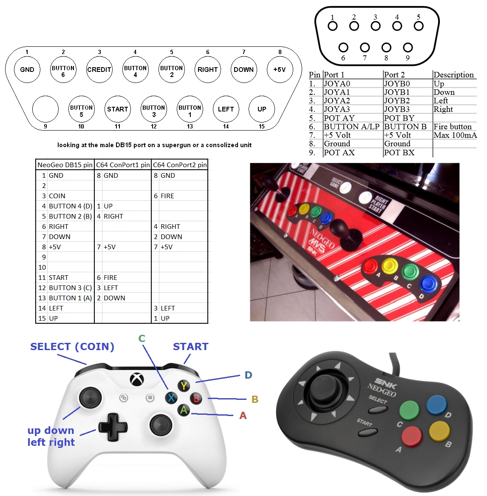

# Unijoysticle2 for NeoGeo

## Directory structure

- folder `neogeo-unijoysticle2`:

    PCB & schematic - unijoysticle2 NeoGeo version - with DB15 connector

- folder `neogeo-unijoysticle2-adapter`:

    & schematic - adapter for unijoysticle2 - 2x DB9 -> DB15

## Schematic + Layout

`.brd` and `.sch` files made in Eagle CAD 6.5.0

## NeoGeo pinout

- NeoGeo DB15 pinout reference
- C64 control port pinout reference
- table describing how corresponding pins are connected
- gamepad button mappings, NeoGeo and MVS controller for reference

## Mappings

Replace file `uni_joystick.c` in in Bluepad32 source code and compile it using `unijoysticle` as `PLATFORM`.

## Additional notes

- neogeo-unijoysticle2 is supposed to be ONLY used as self powered - do not plug in usb power simultaneously, there are no protection diodes (add em if You wish)
- before exporting to gerber all traces on board files should be further optimized, can be traced better/prettier
- description layers should be cleaned up and aligned
- board dimensions should be further adjusted
- uni_joystick.c is still from the version before "enhanced mode bug fix" so J2 = J1
- ment to be used in enhanced mode only, of course, due to 10 controller inputs are required - there is no point in using it in basic mode
- tested 11.12.2021 and working fine with NeoGeo MVS MV1A - should of course work as well with other MVS boards and AES
- keep in mind some MVS supergun's may have DB15 connectors upside down - mirror DB15 connector on the adapter or standalone pcb before making gerbers, otherwise (due to esp32 sticking up out of the pcb) there may be issues plugging in adapter or standalone pcb to Your MVS or AES
- solder cup DB15/DB9 connector or THT connectors may be used - alter board files according to Your preferences

## Author

Hyvax